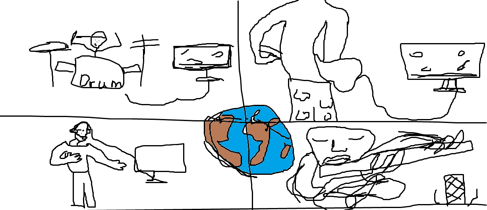
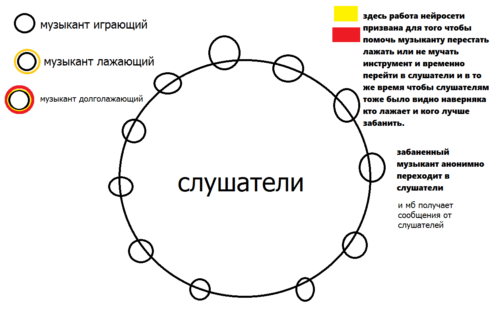

# AudioStudioOnline

"Особенно с появлением квантовых компьютеров
Идея общения в сети без задержек во времени."  
                                        Эпично

## Цель:
создание Музыкальных коллективов с помощью сверхбыстрого интернета,
в котором задержка передачи информации меньше чем 192миллисекунды, а в идеале
или вообще 1мс или "как в реальной звукозаписывающей студии", или 0,1 мс...
или вообще 0 мс, если это логично, (ведь такая божественная скорость мб есть
только в воображении и в "настоящем моменте")

## Обоснование:
(пинг 192мс это минимум, при котором задержка звука становится незаметна)

## Описание Сайта/Портала:
вот например: подключаются к сети музыканты со своими
инструментами, у каждого есть профиль/аватарка каждый включает на своей аватарке
разные "значки" с подробным описанием.
например:  
* значок "музицирую, желающие подключайтесь" (значит, что
любой может без спроса начать  музицировать/джеймить вместе с ним),
* значок "лидеру нужен музыкант" и возможно плюс значки "нужных" и
"нежелательных" муз. инструментов
(значит музыкант уже слышит, то что он хочет сыграть
и мб уже выложил для прослушивания свою мелодию и ищет музыканта который мог бы
сыграть так как хочет лидер, и к музыканту с таким
"значком" кто угодно подключится уже не может, только с предложением/запросом)

## звукозапись:
- либо круглосуточная на магнитные диски с авторскими вырезками понравившихся
фрагментов и автоматическим стиранием несохраненного/непонравившегося каждые
24 часа или дольше.  
- либо с помощью нейросетей  которые начинают автозапись при улавливании
ритма и гармонии  "сольфеджио" (эдакая экспериментальная технология)

## Безконечная музыка:
 безконечные джем сейшены и **без звукозаписи** разделенные
"значками" по кружкам по интересам, там где нету конкретного лидера, и где
музыканты день и ночь сменяют друг друга.

## решение возможных проблем:
**проблема** : дисгармония, лажа и хейтеры  
**решение**: слушатели/музыканты/ценители голосованием могут решить какого музыканта и на
сколько отстранить от музицирования. А чтобы было проще нейросеть помогает
определить "лажающих" музыкантов.
примерная схема:

Приветствуется  дизайнер\художник, творческая личность, мыслитель,
 видящая, всевидящая и желающая внести свою идею для более полного описания
  и понимания проекта, проект закрытый и без финансирования.
 видящая, и желающая внести свою идею для более полного описания
  и понимания проекта, проект открытый и без финансирования.

посему приветсвуются

конструктивная критика и просто комментарии по существу.
